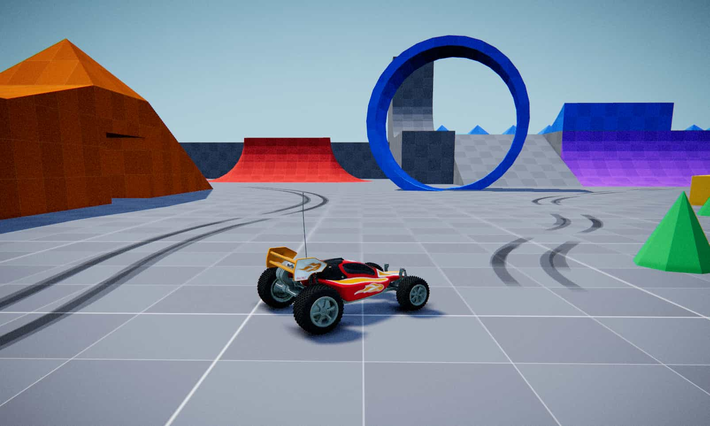

# Raycast RC Car — with a Stunts (1990) web port

[](https://raycast-rc-car.netlify.app/)

I loved the [Raycast RC Car demo](https://raycast-rc-car.netlify.app/) by
[icurtis1](https://github.com/icurtis1/raycast-vehicle) and decided to build a
small **web port of [Stunts (1990)](https://en.wikipedia.org/wiki/Stunts_(video_game))**
on top of it.

The base is an interactive arcade RC car built with [three.js](https://threejs.org)
and [cannon-es](https://github.com/pmndrs/cannon-es): a `CANNON.RaycastVehicle`
chassis with GLB visuals, a GLB driving level, post-processing effects, mobile,
desktop, and browser Gamepad API controls, plus a live tuning panel.

The Stunts port is a second, standalone entry that reuses that engine. It parses
the original `.TRK` track files, rebuilds each track as drivable 3D geometry
(ramps, elevated bridges, loops, corners), and lets you race an AI opponent
through the classic car and driver roster.

The physics approach is inspired by [Bruno Simon's portfolio](https://bruno-simon.com/)
and [swift502/Sketchbook](https://github.com/swift502/Sketchbook): each wheel is
a suspension ray, while the GLB level is converted into static trimesh
colliders for ramps, loops, and walls.

## Run it

Requires Node.js 20+.

```bash
npm install
npm run dev
```

Then open:

- <http://localhost:5173/> — the arcade RC playground (`index.html`)
- <http://localhost:5173/stunts.html> — the Stunts web port

Both pages share the same `src/` engine (`Vehicle.js`, `World.js`) but have
independent main scripts, so the build is multipage — see `vite.config.js`.

## Controls

### Keyboard

| Key | Action |
| --- | --- |
| W A S D / arrows | Drive and steer |
| Shift | Boost |
| Space | Jump / handbrake |
| R | Respawn |
| . (period) | Toggle the tuning panel (playground) |
| Mouse drag | Orbit the camera (scroll to zoom) |

### Touch (phones/tablets)

An on-screen joystick (right) drives and steers, the lightning button (left)
boosts, and the small top-left reset button respawns the car. The tuning panel
is hidden on touch devices.

### Gamepad

| Input | Action |
| --- | --- |
| Left stick / D-pad | Steer and drive |
| Right trigger | Gas |
| Left trigger | Brake / reverse |
| A (bottom button) | Jump |
| B / right bumper | Boost |

## The Stunts web port (`stunts.html`)

A recreation of the classic *Stunts / 4D Sports Driving* experience on top of
the same raycast-vehicle engine.

- **Original tracks.** 84 `.TRK` files ship under `src/stunts/tracks/`
  (the named originals — `bernies`, `cherris`, `helens`, `joes`, `skids`,
  `default` — plus the `r4k*` set). `TrackFile.js` parses the binary format and
  `StuntsTrack.js` rebuilds it into 3D: flat roads, inclined ramps, raised
  elevated roads on pillars, curved corners derived from neighbouring tiles, and
  drivable loops with a stick-to-surface assist.
- **The car roster.** The full 16-car Stunts line-up (Acura NSX, Ferrari GTO,
  Lamborghini Countach, Porsche 962 IMSA, Williams Renault FW12, …) plus an RC
  Buggy, each with its own engine force and top speed and the game's original
  car-bonus coefficient. Cars are visualised with low-poly GLB models you can
  recolour.
- **Drivers.** The classic opponents (Skid Vicious, Bernie Rubber, Herr Otto
  Partz, Joe Stallin, Cherry Chassis) with their bios.
- **AI opponent.** A ghost car traces an ordered lap route through the track and
  you race it — with car-to-car collision, a live 1st/2nd position readout, and
  a wrong-way warning.
- **Cameras.** Cycle chase → hood → cockpit views.
- **Feel & feedback.** Procedural engine sound (no audio assets), a start/finish
  line, a run timer, and a results screen (lap time, top speed, average speed,
  jumps) that freezes the scene when the race ends.
- **Scenery.** A gradient sky dome, distant mountain horizon rings, and fog that
  blends the ground edge into the skyline.

You can also load your own `.TRK` file from the menu.

## How it works

- The chassis is a single `CANNON.Box` rigid body, with small corner spheres so
  it can collide with the level's `CANNON.Trimesh` (cannon-es trimeshes only
  generate contacts against spheres and planes, not boxes).
- Each wheel is a `CANNON.RaycastVehicle` wheel: a ray cast downward that acts
  as a spring/damper suspension and applies engine, brake, and friction forces
  at the contact point. There are no wheel collider bodies, which is what makes
  this technique stable and fast.
- The playground level (`src/assets/rc-level.glb`) is used for both rendering
  and physics: every mesh in it becomes an exact `CANNON.Trimesh` collider, so
  ramps and curved surfaces work without hand-made collision boxes. In the
  Stunts port the track geometry is generated procedurally per tile from the
  parsed `.TRK` and collided the same way.
- Three.js meshes are purely visual and get synced from the physics bodies each
  frame (`Vehicle._syncVisuals`, `World.update`).
- The chase camera smoothly interpolates toward a point behind the car using
  frame-rate-independent exponential damping, pulls back and widens the FOV
  while boosting, and lifts up when the car is airborne.
- A single post-processing pass handles color grading, vignette, chromatic
  aberration, film noise, and the wind-streak speed effect during boost.
- The sun's shadow camera follows the car and snaps to shadow-map texels to
  avoid shimmering shadow edges.

## Tuning the feel

Press `.` or use the **Vehicle Tuning** panel (top-right, lil-gui — closed by
default) to tweak everything live. It is organized into:

- **Vehicle** — engine, steering, brakes, suspension & tires, chassis,
  assists, and jump
- **Camera** — FOV and clipping
- **World** — environment height, teleporter, lighting & shadows
- **Effects** — post processing and tire marks, including rear track spacing
  and forward offset
- **Models** — visual-only GLB transforms for the body and wheels
- **Debug** — FPS readout and physics collider wireframes

"Reset to defaults" restores the shipped values.

Defaults live in `DEFAULT_PARAMS` at the top of `src/Vehicle.js`. Highlights:

- `engineForce`, `boostMultiplier`, `cruiseSpeedKmh`, `maxSpeedKmh` —
  acceleration and top speed (with and without boost)
- `maxSteer`, `steerSpeed` — how sharp and how quickly the car steers
- `frictionSlip` — grip (lower = more drifty)
- `suspensionStiffness` / `suspensionRestLength` — ride height and bounce
- `jumpImpulse`, `airborneGravityScale` — jump height and how floaty it feels
- `inertiaScale`, `antiWheelie`, `tiltClampAirborne`, `uprightAssist`,
  `wallSlideAssist` — the arcade stability assists
- `backWidth`, `backSpacing`, `backForwardOffset` — rear tire mark placement
  and shape

## Project structure

```
index.html            Arcade playground: HUD, mobile controls, styles
stunts.html           Stunts web port: menu, results screen, styles
vite.config.js        Multipage build (index.html + stunts.html)
public/og-image.jpg   Social share preview image
src/main.js           Playground: renderer, camera, post, GUI, input, game loop
src/Vehicle.js        Car physics, controls, visuals, tire marks (shared)
src/World.js          Playground level: trimesh colliders, lights, shadows (shared)
src/stunts/main.js          Stunts port: scene, cars, drivers, AI opponent, race loop
src/stunts/TrackFile.js     Binary .TRK parser
src/stunts/StuntsTrack.js   .TRK → drivable 3D geometry + physics colliders
src/stunts/trackElements.js Track-element (byte id → piece) table
src/stunts/tracks/          84 original .TRK files
src/assets/           Car and level GLBs + reflection texture
```

## Gotchas worth knowing (cannon-es)

1. `CANNON.Trimesh` only collides with spheres and planes. The car's box
   chassis gets four embedded corner spheres so it can hit trimesh walls.
2. Rays fail against rotated `CANNON.Plane` bodies — use boxes or trimeshes
   for the ground instead.
3. A body's AABB is computed once at construction; `position.set()` after
   construction leaves it stale, and rays are broadphase-culled against that
   stale AABB. Call `body.updateAABB()` after placing static bodies.
